# Super Simple Software Factory

> **Repeatable agents-plus-code workflows, packaged as a Bun CLI.**
> Deterministic TypeScript owns the graph. Coding agents are bounded nodes inside it.

`src/` and `src/skills/` are this repository's source of truth. `dist/` is generated package output. Target repositories receive only configuration from `laf init`; runtime evidence is written to the database path selected by that configuration. Read [`docs/ARCHITECTURE.md`](docs/ARCHITECTURE.md) for the canonical system map.

📺 Full breakdown on YouTube: **[Super Simple Software Factory](https://youtu.be/haUfb1ievTE)**

<p align="center">
  
</p>

<p align="center">
  
</p>

A software factory does one thing: it gives you more leverage on your prompt. How much leverage depends entirely on what you invest in it. At the low end you chain two agents together and hope. At the high end you build a system of agents plus code that runs without you, and does the job about as well as you would.

Everyone can get an agent to write code once. Almost nobody gets the same result twice. This fixes that by moving the control plane out of the prompt and into TypeScript. An ADW script (AI Developer Workflow) owns sequencing, retries, and acceptance. Agents work inside named phases. Typed JSON envelopes carry context across the seams. Every event streams into SQLite while it is still happening. **Agent proposes, code disposes.**

> [!NOTE]
> **This branch is the Bun CLI package.** For a demo app, workflow traces, and the
> specs and docs produced by the factory, see the **[`example` branch](../../tree/example)**.

---

## Why this exists

<p align="center">
  
</p>

Hand a capable model your whole SDLC and you get a machine with no seams. There is no phase boundary, so you cannot say which step failed. There is no acceptance criterion you can name, so "done" means "the agent stopped talking." A retry is a cold start that throws away everything the agent just learned. The only trace is a transcript you have to read like a novel. Run it twice, get two different systems.

The fix is not a better prompt. The fix is deciding, deliberately, that **code owns sequencing, retries, and acceptance, and the agent owns only the work inside one bounded phase**. Everything else falls out of that one line. Phases become the unit of the trace. Envelopes become the only way context crosses a seam. Gates become the definition of done. A correction becomes cheaper than a restart, because the session is still alive.

### Agents are great. You do not always need one

This is the part most engineers are going to skip, and pay for later.

Code costs nothing. It runs at the speed of light. You can change it in a second. And you actually own it, which is not true of any model you are renting by the token.

So when the invocation is already known, write it down. `bun test` is not a judgement call. Neither is `ruff check`. An agent rediscovering your test runner burns a context window to learn what a subprocess already knows, and it charges you for the privilege every single run. Worse, it puts a passing test suite into a context window, which buys you nothing at all.

Agents are for the parts that need reading and deciding. Everything else is a `kind="code"` phase. When code fails, the failure comes back to the builder as an envelope, through the same door an agent's report would have used. The repair loop is identical. You just stopped paying an agent to do arithmetic.

The bill for skipping this is not only tokens. It is cost, speed, and consistency, and you pay it on run one hundred and run one thousand, not on run one.

> _Same models. Same prompts. The difference is who owns the loop._

---

## Quick start

Install the Bun CLI, then initialize configuration in the repository where you want to use it:

```bash
bun add --global local-agent-factory
cd /path/to/your-repository
laf init
laf config show
laf workflow list
```

`laf init` creates only `local-agent-factory.config.yaml`. It does not create
`adws/`, `.pi/skills/`, `.env`, `justfile`, or any other repository runtime files.

---

## Install

### Bun package and CLI

The factory is distributed as a Bun package. Bun is the only required runtime; npm is
not required. Install the CLI globally, then use it from any target repository:

```bash
bun add --global local-agent-factory

laf init --global
laf workflow list
laf workflow run prompt "say hello"
laf app run visualizer
```

The CLI keeps workflow and application assets inside the package, so it does not
depend on this source checkout. `laf init` only creates factory configuration and
never installs repository runtime files.

Install one of the two currently approved mock skills locally or globally:

```bash
laf skill list
laf skill install mock-reviewer --local
laf skill install mock-researcher --global
```

Configuration is merged in this order: command-line options, the target repository's
`local-agent-factory.config.yaml`, the global
`~/.config/local-agent-factory/config.yaml`, then built-in defaults. Inspect the
resolved values and their source with `laf config show`.

### Publishing

The Bun package is published to the npm registry. Build the visualizer and publish the
package with:

```bash
bun run build:package
bun publish
```

`laf init` is the only repository initialization command. It writes configuration and
never stamps runtime files into a target repository.

### Which API keys you actually need

That depends on your roster, not on this repo. Every `model:` in `sssf.config.yaml` is written `provider/model-id`, and the provider half decides the key. Which key pi reads for a given provider comes from `~/.pi/agent/models.json`.

The starter roster deliberately mixes providers to show the point, so out of the box it wants three:

| Model in the starter roster                                          | Provider                  | Key                   |
| -------------------------------------------------------------------- | ------------------------- | --------------------- |
| `openai-codex/gpt-5.6-luna` (default roster model)                   | OpenAI Codex via Pi login | `/login openai-codex` |
| `fireworks/accounts/fireworks/models/kimi-k3` (planner)              | fireworks                 | `FIREWORKS_API_KEY`   |
| `openai/gpt-5.6-terra`, `openai/gpt-5.6-luna` (reviewer, documenter) | openai                    | `OPENAI_API_KEY`      |

**Want one key instead of three?** Delete the per-agent `model:` lines and let every agent inherit `defaults.model`. The whole roster then runs on one provider. Cheapest way to get a first green run.

One sharp edge worth knowing: `agents.validate()` checks that a model is _written_ as `provider/id`, not that the provider is reachable or that its key is set. A missing key does not fail at startup. It fails when that agent runs, partway into a chain.

---

## Three principles

Everything here is built to be **observable**, **customizable**, and **reusable**. Those are not adjectives, they are the reason the parts are shaped the way they are.

**Observable.** If you cannot measure your agents, you cannot improve them. Every event goes into SQLite as it happens, so you can watch a run mid-flight, not read about it afterwards.

**Customizable.** One YAML file sets the core four for every agent: context, model, prompt, tools. Different models at different price and speed points, in the same run. It is not about which model is best anymore, it is about which model is right for that one phase.

**Reusable.** The whole thing is a Bun package you can configure for any repository. The tests it ships are not your tests. The prompts it ships are starters. It is designed to be edited.

There are three actors here, and the design keeps them separate on purpose: **the engineer**, **the code**, and **the agents**. The trick is not running more agents. The trick is using all three at the right moment.

---

## Package assets

The Bun package contains the CLI, workflow definitions, the visualizer, and approved
mock skills. These assets stay inside the package; installing the package does not copy
them into a target repository.

`laf init` creates one self-contained `local-agent-factory.config.yaml` containing the workflow defaults, agent roster, inline prompts, and visualizer settings. Runtime data is written only when a command is explicitly run against the configured database.

There is no repository stamping step, remote installer, or generated `adws/` tree.

---

## The agent roster

`local-agent-factory.config.yaml` answers one question per entry: who is this agent. One agent, one prompt, one purpose. Prompts are inline strings, so the target repository has no dependency on factory-owned YAML or Markdown files.

```yaml
workflow:
  database: .laf/sssf.db
  defaults:
    coding_agent: pi
    model: provider/model-id
    thinking: medium
    tools: [read, bash, edit, write]
  agents:
    - name: planner
      purpose: Turn a request into a plan.
      prompts:
        system: |
          You are a bounded workflow agent.
        user: |
          Work on this request: {{prompt}}
      writes: [specs/]
      tools: [read, bash, write]
```

Starter agents ship in the box, including `planner`, `builder`, `scout` (read-only recon), `reviewer`, and `documenter`. There is no tester, because running a suite is a known command and therefore code.

Every agent gets its own model, thinking level, prompts, and built-in Pi tools. Give the planner a frontier model and the builder a cheap fast one. Give the reviewer no ability to write code at all. Extensions, custom tools, and subagents are deliberately outside the factory's runtime surface.

**`tools` is a capability list. `writes` is the boundary.** They are not the same thing, and the difference matters: `bash` runs anything, including `git checkout`, and `write` reaches any path. So "this agent changes nothing" is enforced in code, after every call, by comparing the repo before and after. Unauthorized changes are rolled back and the phase fails. A read-only agent is read-only with respect to your repo, never unable to write its own report.

Config defines who an agent **is**. The ADW call site defines how it is **used**. That split is what lets one agent serve many different calls. **ADW scripts never name a model, they name an agent.**

---

## Phases: three lanes, one primitive

<p align="center">
  
</p>

Every run is a sequence of phases, and every phase is the same context manager no matter who owns it.

```typescript
REQUIRED_AGENTS = ["planner", "builder", "reviewer"]   # names, never models

cfg = agents.load_config(config)
agents.validate(cfg, REQUIRED_AGENTS)   # a missing agent fails before anything spawns
run = session.ensure(cfg, adw_id)       # pin-or-create the session

with run.phase(PhaseParams(name="plan", kind="agent", owner="planner",
                           description="Turn the request into an implementable plan")) as ph:
    plan = ph.call(AgentCall(output_type=PlanOutput, prompt=prompt,
                             gates=[gates.artifacts_exist, gates.files_non_empty]))

with run.phase(PhaseParams(name="commit", kind="code", owner="git",
                           description="Commit the working tree")) as ph:
    message = build.commit_message or f"sssf({run.adw_id}): {build.summary}"
    ph.log(sha=git_helper.commit_all(message), message=message)

return run.finish(accepted=review.approved, reason="the reviewer never approved")
```

Three kinds, three swim lanes. **engineer** is the human lane. **agent** is `ph.call(...)`: prompt in, typed envelope out, gates verified. **code** is a deterministic step that stands on its own, like a commit or a migration, and it is never buried inside an agent phase, so the trace shows exactly when code ran and when an agent was working.

That commit phase is the whole pattern in miniature. The builder proposes the message as a field on its envelope. Code decides whether to use it, falls back when it is empty, and performs the write. The agent never runs `git commit` itself.

**Success must be earned.** Every phase defaults to `fail`. A clean exit flips it, and an agent phase also needs its envelope to parse and every gate to come back green. `run.finish(accepted=...)` adds the second question, because phases passing is not the same as the run being acceptable: a test phase that ran a red suite did its job perfectly. One call settles the exit code, the session status, and the banner together, so they cannot disagree.

---

## Envelopes and gates

<p align="center">
  
</p>

An agent has exactly two output channels: reference files written into `context_handoff/`, and a final valid-JSON response parsed against the output type the call declared. Code persists that response as `envelope.json`, records it, and injects it into the next agent's prompt. Context transfers in code, not in conversation.

```typescript
class EnvelopeBase(BaseModel):
    status: Literal["success", "fail"]
    summary: str = ""
    artifacts: list[str] = Field(default_factory=list)
    notes_for_next_agent: str = ""

class BuildOutput(EnvelopeBase):
    changed_files: list[str] = Field(default_factory=list)
    commit_message: str = ""        # consumed by the git commit phase
```

Determinism is wired into every step. Agents must return a specific structure, every time. If it does not parse, they get asked again until it does.

Gates verify claims, never predictions. Nobody knows which files an agent will touch before it finishes, so gates run **after** the fact against the envelope's own declarations: `artifacts_exist`, `files_non_empty`, `json_parses`, `diff_matches_claims`, `tests_pass(...)`. A gate is a callable with the signature `gate(envelope, run) -> GateReport`, one `check(item, ok, note)` per thing it examined, so a green gate tells you _what_ it verified.

When JSON does not parse or a gate returns violations, **nothing restarts**. The harness re-prompts the same session with a correction naming exactly what was wrong, and the context window stays intact. Pi treats `--session-id` as create-or-continue, so running an agent and continuing it are the same call. A cold restart throws away everything the agent learned. A correction costs one message.

The output contract lives in three places and they are one thing: the type in `data_types.ts`, the JSON example in that agent's `user.md` `## Report` section, and `output_type=` at the call site. **Change one, change all three in the same edit.**

---

## The trace

<p align="center">
  
</p>

One data path, no exceptions: **agents write to SQLite, readers poll SQLite.** `agent_pi.ts` tails the coding agent's JSONL stdout line by line and the tracer inserts each event while the agent is still working, so tool calls are visible mid-run instead of batched at the end.

Ten event types land across seven tables: `sessions`, `phases`, `events`, `envelopes`, `gate_results`, `agent_sessions`, and `processes` (adw_id to pid, so a stuck run can be found and stopped). Every event logs against both its `adw_id` and its `phase_id`, and `parent_id` nests spans, so an agent phase expands into its own tool calls.

Pi announces a tool call across three raw events, so the interface folds them into exactly **one** `tool_call` row per real call. Each row is named the way you would read it aloud (`bash: ls -la src`) and carries `{tool, tool_call_id, args, result_snippet, ok, duration_ms, agent}`.

```sql
select * from events where adw_id = ? and rowid > ? order by rowid limit 500;
```

That one cursor query is the entire transport. Live view and full history are the same query at different cadence, which is why there is no ingest endpoint, no WebSocket, no backfill, and no separate replay path. Every connection opens WAL, so reads never block the running writers.

Files stay the raw record (`raw_output.jsonl`, `envelope.json`, `agent_map.json`). The db is the queryable mirror. Losing it loses nothing you cannot rebuild.

The package ships a read-only UI for the trace database. Start it through the CLI:

```bash
laf app run visualizer --database /path/to/sssf.db
```

The visualizer listens on the configured port (4600 by default) and does not require a
`.pi/skills/` directory or a stamped repository.

---

## What is in this branch

```text
local-agent-factory/
├── src/entrypoints/cli.ts              # the `laf` command
├── src/modules/                         # workflow and distribution modules
├── src/skills/sssf/apps/visualizer/    # packaged trace UI
└── package.json                         # Bun package metadata
```

The package is self-contained. `laf init` creates configuration only; it does not copy
source, workflow, skill, environment, or task-runner files into another repository.

---

## Registered workflows

Every workflow takes the same shape:

```bash
laf workflow run <workflow-id> "<prompt>" [--cwd /path/to/repository]
```

| ADW                             | Chain                                  | Reach for it when                                            |
| ------------------------------- | -------------------------------------- | ------------------------------------------------------------ |
| `run.ts prompt`                 | engineer to \<agent\>                  | one agent, one prompt, `--agent NAME` picks who              |
| `run.ts scout`                  | engineer to scout                      | read-only recon, nothing changes                             |
| `run.ts plan`                   | engineer to planner                    | you want the spec before any code                            |
| `run.ts build`                  | engineer to builder                    | the plan already exists                                      |
| `run.ts quality`                | engineer to code(quality)              | lint, typecheck, build, no agents at all                     |
| `run.ts build-review`           | builder, reviewer, bounded revise loop | "is this what was asked for" matters more than "does it run" |
| `run.ts double-tdd`             | outer and inner TDD loops              | drive implementation from acceptance scenarios               |
| `run.ts document`               | code(git diff), documenter             | write up what just shipped                                   |
| `run.ts prd-oriented-discovery` | research, PRD, technical design        | discover and design from evidence                            |
| `run.ts prd-oriented-design`    | research, PRD, technical design        | turn existing research into a technical design               |
| `run.ts research`               | researcher                             | gather evidence for a problem before planning                |
| `run.ts prewalk`                | planner, builder                       | hand off one Pi session from planning to implementation      |
| `run.ts ship`                   | builder, repository handoff            | implement an outline and prepare its pull request handoff    |

The repository-only composition examples are documented in [`docs/adw-examples/`](docs/adw-examples/). They are not installed into target repositories.

`--adw-id` is optional everywhere. Omit it and a fresh id is minted and printed. Supply it and the run joins that session: same dirs, same `context_handoff/`, and each agent **resumes its existing context window** through `agent_map.json` instead of starting cold. That is how you chain workflows.

```bash
laf workflow run plan "add a /health endpoint"
laf workflow run build "implement the plan"
```

Watch a run with the trace db directly:

```bash
sqlite3 .laf/sssf.db "select adw_id, status, substr(request,1,60), total_tokens from sessions order by started_at desc limit 10;"
sqlite3 .laf/sssf.db "select seq, name, kind, owner, status from phases where adw_id='a1b2c3d4' order by seq;"
sqlite3 .laf/sssf.db "select kind, name, pid, command from processes where adw_id='a1b2c3d4' and ended_at is null;"
```

Reads never block a running workflow; the trace database uses WAL. Inspect it directly
with your database tooling or point `laf app run visualizer` at it.

---

## Where it can still fail

Honest edges, because knowing them is cheaper than discovering them.

| Failure                                      | What actually happens                                                                                                                     | What to do                                                                                                     |
| -------------------------------------------- | ----------------------------------------------------------------------------------------------------------------------------------------- | -------------------------------------------------------------------------------------------------------------- |
| A bare model pattern                         | The same model sits under several providers, so `gemini-3.6-flash` matches three catalog entries and `agents.validate()` refuses to spawn | Always write `provider/model-id`                                                                               |
| The source directory is not a Git repository | The target design rejects source-changing work before any agent or command runs                                                           | Initialise Git and provide a clean expected revision before requesting a source-changing workflow              |
| A coding agent hangs silently                | No events, no tokens, an empty `raw_output.jsonl`. The trace goes quiet rather than red                                                   | Query `processes` for what is alive and kill it children-first. A killed run finalizes its own trace to `fail` |
| The synced triad drifts                      | Type, `## Report` example, and `output_type=` disagree, so every call burns correction rounds                                             | Grep the type name and fix all three in one edit                                                               |
| Gates pass, output is bad                    | Gates check what a predicate can check, not plan quality or code taste                                                                    | Run the `reviewer`, or read it yourself                                                                        |
| An agent edits something it should not       | Detected and rolled back after the call, and the phase fails                                                                              | Expected. Widen that agent's `writes` if the change was legitimate                                             |
| Commit phase has nothing to commit           | `commit_all` raises if the cwd is not a git repo or nothing changed                                                                       | `git init` with one commit first. A no-op build fails the phase rather than committing nothing                 |
| `coding_agent: pi`                           | Supported coding agent                                                                                                                    | Use Pi                                                                                                         |

The canonical runtime path requires a clean Git source commit at the expected revision, creates a disposable clone, rechecks the source after completion, and stops at a manual review result. The source-architecture migration removes the non-Git copy path rather than treating weaker source safety as a second workflow mode. The factory never merges, pushes, deploys, or integrates the workspace automatically.

**Is this overkill for a one-off feature?** Yes. Prompt an agent and move on. This earns its keep when the same workflow runs a hundred times, when validation is the only thing standing between you and a bad merge, and when you need the thousandth run to look like the first.

---

## Built to be Observed, Customized, and Reused

This is a starting point, not a product. Nothing here is meant to survive contact with your codebase unchanged.

The tests it ships are not your tests. The prompts it ships describe a demo app, not your domain. The roster names the models that were good the week it was written. All of that is supposed to be replaced, and the whole thing is shaped so that replacing it is a small edit in an obvious file instead of a rewrite. That is what those three properties are for. **Observable** so you can see which part is actually costing you. **Customizable** so the fix is one file. **Reusable** so you do it once and stamp it everywhere.

Where to start, roughly in the order that pays off fastest:

| Change                  | File                              | Why                                                                                              |
| ----------------------- | --------------------------------- | ------------------------------------------------------------------------------------------------ |
| Your real commands      | `adws/factory/modules/quality.ts` | The shipped blocks are placeholders that exit 0. Until you wire this, your test phase is theater |
| Your prompts and roster | `local-agent-factory.config.yaml` | Models, thinking levels, tools, write boundaries, and inline prompt text                         |
| Your chains             | Package workflow registry         | Select a registered workflow and customize the request                                           |
| Your definition of done | `adws/factory/modules/gates.ts`   | A gate is one function. Whatever "done" means where you work, write it here                      |
| Your agent capabilities | `local-agent-factory.config.yaml` | Built-in Pi tools and write boundaries, configured per agent                                     |

It still does not provide cloud workers, distributed scheduling, or automatic integration. The local safety boundary is the clean source check, disposable clone, bounded process runner, isolated environment, durable evidence, and manual review Gate.

So take it. Fork it, strip the parts you do not need, rename the agents, throw out half the workflows, and roll what is left into the factory your product actually needs. The specific chains in here matter far less than the shape: code owns the loop, agents own the phases, and every run leaves a trace you can go read.

---

## See it in a real repo

The [`example` branch](../../tree/example) contains a demo app, workflow traces, and the
specs and docs produced by the factory.

```bash
git clone <this-repo> sssf && cd sssf
git checkout example
```

---

## License

MIT, see [`LICENSE`](LICENSE).

---

## Master Agentic Coding

<p align="center">
  
</p>

Vibe coding is not knowing how your system works, and not looking. Agentic engineering is knowing how your system works so well that you do not have to look.

Master agentic coding by gaining a deeper understanding of the foundational units of the software factory.

Learn tactical agentic coding patterns with [Tactical Agentic Coding](https://agenticengineer.com/tactical-agentic-coding?y=sssf).

Follow the [IndyDevDan YouTube channel](https://www.youtube.com/@indydevdan) to improve your agentic coding advantage.

---

Stay Focused and Keep Building

- IndyDevDan
